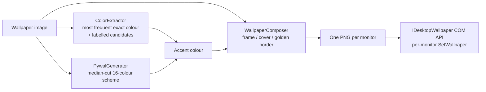

# paperWiz

**Per-monitor wallpapers that share one image's colour — so every screen matches, whatever its size or shape.**

paperWiz solves a small, real problem for multi-monitor and HiDPI setups: one wallpaper never fits every screen. It pulls the dominant colour from the wallpaper you choose and uses it two ways:

- **Your other monitors are painted that colour** — no more hunting for a matching second wallpaper, duplicating one across screens, or spanning one and losing half of it.
- **Smaller and portrait wallpapers are framed in that colour** instead of being stretched or cropped, so low-resolution and vertical images look intentional on a big display.

It comes in two generations that live side by side in this repo:

| | Platform | What it is |
|---|---|---|
| [`windows/`](windows/) | Windows 10/11 | A native **C# / WPF (.NET 8)** app with a live per-monitor preview, a built-in pywal-style palette engine, and a per-user installer |
| [`linux/`](linux/) | Linux (X11) | The original **Bash script** driving `feh`, `pywal` and ImageMagick |

<!-- screenshot: the Windows app — monitor layout preview on the right, wallpaper card, pywal palette and labelled colour swatches on the left -->
<!-- demo gif: the Linux script framing a small portrait wallpaper and painting the second monitor in the matched colour -->

## Windows app

The Windows build talks directly to the shell's `IDesktopWallpaper` COM API, so each monitor genuinely gets its own image — a monitor-exact composite rendered by the app, not a stretched copy.

**Highlights**

- **Live preview** of your actual monitor layout; click a display to give it the wallpaper, the rest get the accent colour. What you see per monitor is exactly what gets set.
- **No Apply button** — every change applies automatically (rapid tweaks like slider drags are coalesced so it applies once you pause).
- **Accent colour, three ways:**
  - a **pywal-style 16-colour scheme**, generated by a native re-implementation of pywal's default backend (median-cut quantisation + the same slot assembly) — no Python or ImageMagick needed;
  - **labelled picks from the wallpaper** — *Most common* (the exact algorithm the Linux script uses), *Most vibrant*, *Average*, *Darkest*, *Lightest* — each with a tooltip explaining why it was suggested;
  - a custom hex code or RGB sliders.

  Your pick is remembered as a *role*: choose "Darkest" and the next wallpaper you load uses *its* darkest.
- **Placement control:** Auto / Frame / Cover, a 3×3 anchor grid, an optional height cap for tall portrait images, and a golden-ratio border (the image insets to 1/φ ≈ 62% so the accent frames it).
- **Wallpaper sources:** drag-and-drop, a file picker, or point it at a folder and click through a thumbnail gallery.
- **HiDPI-correct:** PerMonitorV2 DPI awareness plus monitor-exact composites applied with shell position *Fill*, so mapping is 1:1 regardless of scaling.

### Install (Windows)

Requires Windows 10 (1903+) or 11. Get the code first — `git clone https://github.com/chrisJuresh/paperWiz.git`, or **Code → Download ZIP** on GitHub and extract it.

Double-click **`install.bat`** in the repo root. It builds a self-contained `PaperWiz.exe` (bundles the .NET runtime), installs it per-user to `%LOCALAPPDATA%\Programs\paperWiz`, adds Start menu and Desktop shortcuts, and registers it under **Settings → Apps** — no admin rights needed. Building requires the [.NET 8 SDK](https://dotnet.microsoft.com/download/dotnet/8.0).

From a terminal, the equivalent is:

```powershell
cd paperWiz\windows
.\install.ps1          # build + install (add -Launch to open it when done)
```

Other ways to run it:

```powershell
.\run.ps1              # run from source (Debug) — or: dotnet run --project src\PaperWiz
.\publish.ps1          # just build the standalone exe → windows\publish\PaperWiz.exe
```

Or open `windows/PaperWiz.sln` in Visual Studio 2022 and press F5. The full Windows guide lives in [`windows/README.md`](windows/README.md).

The exe isn't code-signed, so the first launch may show a SmartScreen prompt — **More info → Run anyway**. Uninstall via `windows\uninstall.bat` or Settings → Apps.

### How it works



- `ColorExtractor` reproduces the Linux script's algorithm exactly: shrink the image so its longest edge is ≤ 500 px, then take the single most frequent exact colour — no quantisation, no weighting.
- `PywalGenerator` re-implements pywal's `wal` backend natively: median-cut quantisation into 16 colours, the same slot layout (darkened background, six accents plus bright variants, light foreground), and a gentle saturation lift.
- `WallpaperComposer` renders a full-resolution image per monitor; `WallpaperService` writes each one atomically to `%LOCALAPPDATA%\PaperWiz\cache` and sets it via the shell API.
- The UI is plain WPF with hand-rolled MVVM — the only NuGet dependency is `System.Drawing.Common`.

## Linux script

The original paperWiz (2021): a single Bash script that sets the main monitor with `feh`, paints the second monitor with the extracted colour, and composes a colour frame around too-small wallpapers with ImageMagick. It also triggers `pywal`/`wpgtk` theming as a side effect.

```
Usage: paperWiz [OPTIONS]
  -w WALLPAPER_PATH   Path to the wallpaper you want to set (required)
  -p POSITION         Position on the main monitor (c: center, s: south, n: north, w: west, e: east)
  -c [WALCOLOR]       Second-monitor colour (0-15: pywal colours, -1: dominant colour, default)
  -s                  Shrink the wallpaper's vertical resolution first
  -h                  Help
```

Setup: run `./install-paperWiz` once (creates `~/.cache/paperWiz`), edit `resW`/`resH`/`smallwallres` at the top of `linux/paperWiz` to match your main monitor, `chmod +x linux/paperWiz`, and run it or drop it on your `$PATH`. Dependencies: **ImageMagick, feh, pywal** (plus optional theming hooks: wpgtk, xdotool, dunst). See [`linux/README.md`](linux/README.md) for details, including an `sxiv` key-binding recipe.

A Python/Pillow port of the script lives on the [`python` branch](../../tree/python).

## Project structure

```
install.bat            # double-click Windows installer (shim for windows/install.ps1)
install-paperWiz       # Linux one-time setup (cache directory)
linux/
├── paperWiz           # the original Bash script
└── README.md
windows/
├── PaperWiz.sln
├── install.ps1 / uninstall.ps1 / run.ps1 / publish.ps1
└── src/PaperWiz/
    ├── Interop/       # IDesktopWallpaper COM projection
    ├── Services/      # ColorExtractor, PywalGenerator, WallpaperComposer, MonitorService, WallpaperService
    ├── ViewModels/    # MVVM (no framework)
    ├── Themes/        # dark theme
    └── MainWindow.xaml
```

## Status

Personal project, developed in bursts since 2021 — the Linux script is stable and unchanged since 2023; the Windows app (v2.0) landed in July 2026 and is where current work happens. In progress on a branch: remembering your setup between sessions, restoring the wallpaper automatically after sign-in, and rotation controls.

## Limitations

- The Windows installer builds from source, so it needs the .NET 8 SDK (there are no prebuilt releases yet).
- The Linux script assumes a two-monitor X11 setup and takes its resolution from variables at the top of the file.
- The published exe is unsigned (expect a one-time SmartScreen prompt).
